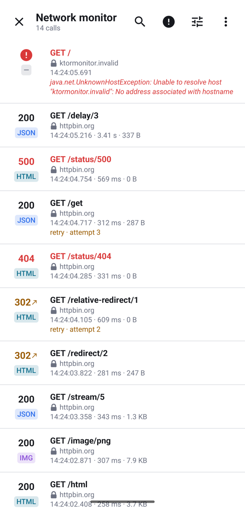
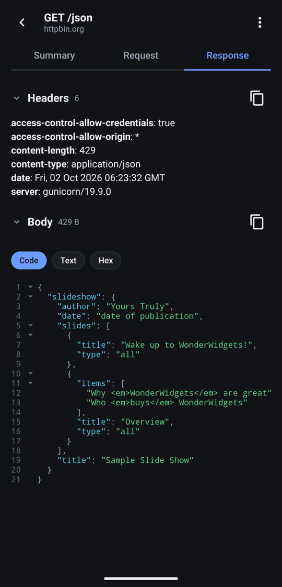
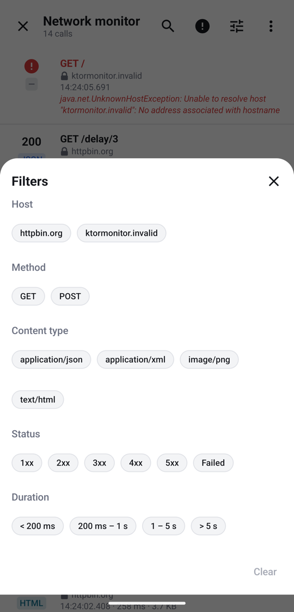
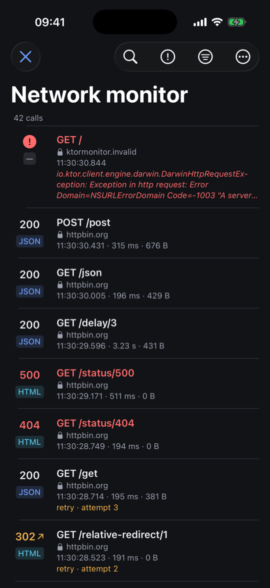
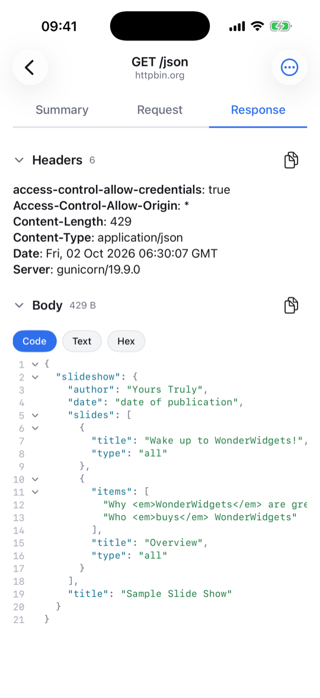

# Ktor Monitor

[](https://central.sonatype.com/namespace/uz.jahonov)
[](https://github.com/JahonovAsilbek/Ktor-Monitor/actions/workflows/ci.yml)
[](LICENSE)


See every HTTP call your [Ktor](https://ktor.io) client makes, inside the app itself. Shake the
device or tap the notification: the list of calls opens, with their headers, bodies, timings and
errors. For Kotlin Multiplatform and Android apps, with a native UI on each platform: Compose on
Android, SwiftUI on iOS.

<table>
  <tr>
    <th>Android</th>
    <td></td>
    <td></td>
    <td></td>
  </tr>
  <tr>
    <th>iOS</th>
    <td></td>
    <td></td>
    <td></td>
  </tr>
</table>

## Why Ktor Monitor

- **One monitor for both platforms.** Capture, history, search and exports are shared Kotlin; the
  screens are native, so it looks and behaves like part of the platform on Android and on iOS.
- **It sees what really went over the network.** Each attempt is its own row: a 401, the token
  refresh and the retry show as three calls, each with the headers that actually went out.
- **Streams are not a blind spot.** Streamed bodies and server-sent events are recorded as they
  arrive, without consuming them for the app.
- **It never gets in the app's way.** A failure inside the monitor (the database, a parser, the
  UI) never fails, delays or changes the app's call, and never crashes the app.
- **Light on your app.** No Material, no DI framework, no logging library: Compose foundation on
  Android, SwiftUI on iOS, and a theme of its own that yours never leaks into.
- **Shareable.** Any call goes out as cURL, wget, text, Markdown or JSON; the whole history as
  **HAR**, which opens in Chrome DevTools, Charles and Proxyman.
- **Two lines to set up**, and kept out of release builds by the usual debug-only dependency.

## Features

- **Bodies of every kind.** JSON, XML, HTML, forms, multipart, CSS, JavaScript, YAML and Markdown
  are highlighted and fold; images and Markdown render; anything else shows as text or hex.
- **History** that survives restarts, with a retention period and a maximum number of calls.
- **Search** in URLs, methods, status codes and bodies; **filters** by host, method, content type,
  status class or failure, and duration; sorting.
- **Ways in:** a notification with the latest calls, a shake of the device, or one call from code.
- **Redaction** of headers, query parameters, and JSON or form fields, when you want it.
- **Light and dark** themes, following the system.

## Quick start

### Android

**1. Add the dependencies**, for debug builds only:

```kotlin
// app/build.gradle.kts
dependencies {
    debugImplementation("uz.jahonov:ktor-monitor:0.1.0")
    debugImplementation("uz.jahonov:ktor-monitor-ui:0.1.0")
}
```

**2. Create the monitor and attach it to your client.** Release builds do not compile `src/debug`,
so put it there, and give `src/release` the same function doing nothing:

```kotlin
// src/debug/kotlin/com/example/DebugTools.kt
fun installDebugTools(app: Application, client: HttpClient) {
    val monitor = KtorMonitor(app)
    monitor.attach(client)
    KtorMonitorUi.install(app, monitor)
}

// src/release/kotlin/com/example/DebugTools.kt
fun installDebugTools(app: Application, client: HttpClient) = Unit
```

**3. Call it** from `Application.onCreate`:

```kotlin
class App : Application() {
    override fun onCreate() {
        super.onCreate()
        installDebugTools(this, httpClient)
    }
}
```

Run the app, make a call, then shake the device or tap the notification.

### Kotlin Multiplatform + iOS

**1. Depend on the core in the shared module, and export it from the iOS framework**, so Swift sees
`KtorMonitorBridge`:

```kotlin
// shared/build.gradle.kts
kotlin {
    listOf(iosArm64(), iosSimulatorArm64()).forEach {
        it.binaries.framework {
            baseName = "Shared"
            export("uz.jahonov:ktor-monitor:0.1.0")
        }
    }
    sourceSets.commonMain.dependencies {
        api("uz.jahonov:ktor-monitor:0.1.0")
    }
}
```

**2. Create the monitor on the iOS side of the shared code** and attach it to your client:

```kotlin
// shared/src/iosMain/kotlin/com/example/Monitor.kt
object Monitor {
    private val monitor = KtorMonitor()
    val bridge = KtorMonitorBridge(monitor)

    fun attach(client: HttpClient) = monitor.attach(client)
}
```

**3. Add the Swift package.** In Xcode: *File → Add Package Dependencies…*, enter
`https://github.com/JahonovAsilbek/Ktor-Monitor`, pick version `0.1.0` (the same version as the
Kotlin artifacts) and add the `KtorMonitorUI` product to your app.

**4. Connect the two and install it:**

```swift
import Shared
import SwiftUI
#if DEBUG
import KtorMonitorUI

// The one line that connects the Kotlin bridge to the SwiftUI package.
extension KtorMonitorBridge: @retroactive KtorMonitorUIBridge {}
#endif

@main
struct MyApp: App {
    init() {
        #if DEBUG
        KtorMonitorUI.install(bridge: Monitor.shared.bridge)
        #endif
    }

    var body: some Scene {
        WindowGroup { ContentView() }
    }
}
```

Shake the device (*Device → Shake* in the simulator) to open it. `@retroactive` needs Xcode 16;
drop it on older versions.

## Usage

### Opening it

| | Android | iOS |
|---|---|---|
| From code | `KtorMonitorUi.open(context)` | `KtorMonitorUI.present()` |
| Inside your own screen | | `KtorMonitorView(bridge:onClose:)` |
| Without the shake | `install(app, monitor, shakeToOpen = false)` | `install(bridge:shakeToOpen: false)` |

`monitor.clear()` (a suspend function) deletes the history.

On iOS, if the app sets its own `UNUserNotificationCenterDelegate`, pass notification responses to
`KtorMonitorUI.handleNotificationResponse(_:)` first, so a tap on the monitor's notification opens
it.

### Where to attach

Attach the monitor **after** any plugin that retries requests, such as token refresh or
`HttpRequestRetry`. It then sees each attempt with its final headers. It installs an `HttpSend`
interceptor, so attaching it to a client built earlier is fine.

In an Android app with more than one process (a `:remote` service, a push process), install it in
the main process only: `Application.onCreate` runs in each of them.

### Configuration

```kotlin
val monitor = KtorMonitor(app) {
    retention = Retention.OneDay
    maxCalls = 500
    sanitizeHeaders("Authorization", "Cookie", "Set-Cookie")
    redactQueryParameters("access_token")
    redactBodyFields("password", "refreshToken")
    filter { request -> request.url.host != "analytics.example.com" }
    onInternalError = { error -> Log.w("KtorMonitor", error) }
}
```

| Option | Default | |
|---|---|---|
| `isActive` | `true` | `false` records nothing |
| `retention` | `OneHour` | `OneHour`, `OneDay`, `OneWeek`, `Forever` |
| `maxCalls` | `1000` | the oldest go first |
| `maxContentLength` | `250000` | bytes kept per body; the rest is counted, not stored |
| `showNotification` | `true` | the notification with the latest calls |
| `appName`, `appVersion` | from the platform | named in exports |
| `onInternalError` | ignore | failures of the monitor itself |
| `filter { request -> … }` | | record only the calls it accepts |
| `sanitizeHeader { name -> … }`, `sanitizeHeaders(…)` | | replace header values |
| `redactBodyFields(…)` | | replace JSON keys at any depth, and form fields |
| `redactQueryParameters(…)` | | replace URL query parameter values |

Nothing is redacted by default: against a development backend, the tokens are what you want to
see. A JSON body that should be redacted but cannot be parsed (cut at `maxContentLength`, malformed)
is not recorded at all. Multipart and other bodies are recorded as they are.

## Keeping it out of release builds

The monitor records everything, tokens included, and a shake opens it. Ship it in debug or internal
builds only:

- **Android:** `debugImplementation` (or a flavor's configuration), with the monitor created in a
  source set release builds do not compile, as in the quick start. `ktor-monitor-ui` also adds the
  `POST_NOTIFICATIONS` permission to the app's manifest, so a release build that does not depend on
  it does not ask for it either.
- **iOS:** export `ktor-monitor` only from the framework your debug or internal builds link, and keep
  the Swift lines behind `#if DEBUG` (or the condition of your internal builds).

The notification shows only its title on the lock screen, and its lines leave out query strings.

## Troubleshooting

- **No calls show up.** Check that `attach(client)` runs on the client the app actually uses, and
  that `filter` does not drop them.
- **A retry shows the old token.** Attach the monitor after the plugin that refreshes it.
- **No notification.** On Android 13+ and on iOS the app needs notification permission; the monitor
  shows a banner to ask for it. Shaking still works without it.
- **`KtorMonitorBridge` is unknown in Swift.** The framework must `export` the core, and the
  dependency must be `api`, as in step 1.
- **Nothing happens on shake in the simulator.** Use *Device → Shake* (⌃⌘Z).

## How iOS works

Kotlin types reach Swift only through the app's own framework, whose name the SwiftUI package
cannot know. So the package talks to the monitor through `KtorMonitorUIBridge`: strings and
closures only, with states, effects and events as JSON. The Kotlin `KtorMonitorBridge` has exactly
those members, which is why one `extension` line connects them. The JSON contract is pinned by
fixtures in `ios/KtorMonitorUI/Tests/KtorMonitorUITests/Fixtures`, which the Kotlin tests write and
the Swift tests read.

## Samples

- Android: `./gradlew :sample:installDebug`
- iOS: open `ios/Sample/Sample.xcodeproj` and run the `Sample` scheme. On a device, pick your team
  and change the bundle identifier first. Its build phase runs Gradle, which needs a JDK that Xcode
  can find (`JAVA_HOME`, or `/usr/libexec/java_home`).

Both make calls against [httpbin.org](https://httpbin.org) that show each kind of body and failure.

## Requirements

- Kotlin 2.3 or later, and Ktor 3.6 or later (which itself needs Kotlin 2.3).
- Android: minSdk 24; the UI needs Compose foundation 1.8, activity-compose 1.10, core 1.13 and
  lifecycle 2.8 or later.
- iOS: 16 or later, on devices and Apple silicon simulators (`iosArm64`, `iosSimulatorArm64`); Intel
  simulators are not supported.
- Building the library itself: JDK 17.

The Maven group is `uz.jahonov`. Another library with a similar name exists
(`ro.cosminmihu.ktor:ktor-monitor`); the two are unrelated.

## Support

Ktor Monitor is free and open source. If it saves you time, you can buy me a coffee — it keeps the
project going.

<a href="https://buymeacoffee.com/jahonov"></a>

Bug reports and ideas are welcome in [Issues](https://github.com/JahonovAsilbek/Ktor-Monitor/issues),
and a ⭐ helps others find it.

## License

[Apache 2.0](LICENSE)
